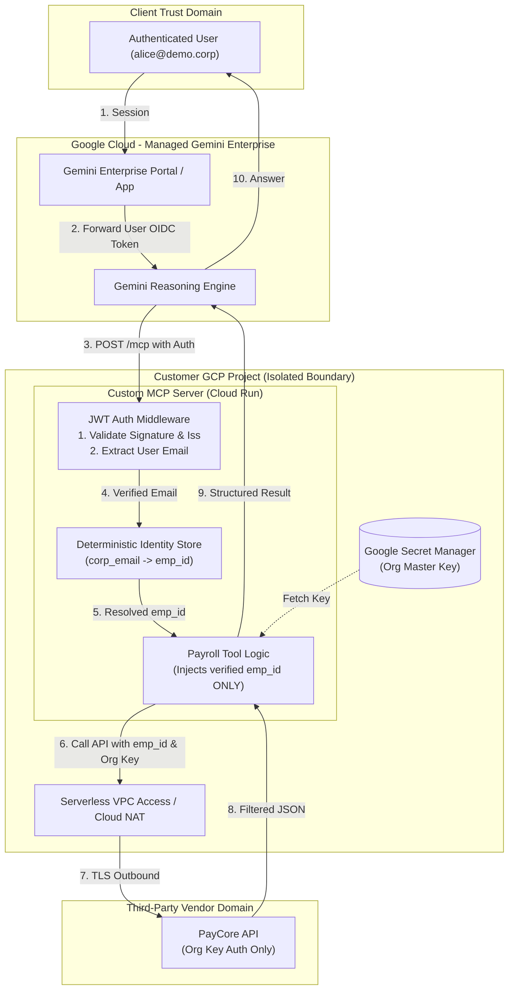

# Gemini Enterprise Data Connectivity Architecture

## 1. The Architectural Paradigm Shift
A frequent failure in enterprise LLM adoption is treating **Ingestion**, **Federation**, and **Custom MCP** as interchangeable "connectors". They operate in fundamentally different execution planes and carry distinct security trust models.

* **Ingestion**: Storage & Index Plane (Discovery Engine). Best for static/historical knowledge. Server-side ACLs.
* **Federation**: Distributed Query Proxy. Best for remote search engines (Drive, Jira). Zero duplication.
* **Custom MCP (Tooling)**: Agent Reasoning & Execution Plane. Best for transactional APIs, mutations, and zero-trust proxying.

## 2. Common Architectural Fallacies
- **Fallacy**: "Native connectors default to federation." 
  **Reality**: Native connectors (Jira, Salesforce, Confluence) strictly default to Ingestion (batch crawling).
- **Fallacy**: "The LLM will enforce data authorization based on system prompt."
  **Reality**: Security MUST NOT rely on LLM obedience. Authorization must be enforced deterministically at the data or middleware layer.
- **Fallacy**: "Custom MCP is fully GA."
  **Reality**: Custom MCP Server data stores are in Public Preview (July 2026).

## 3. The Target Architecture (Razorpay / PayCore Pattern)
For systems that use a single Org-level API key without per-user OAuth scoping (e.g., legacy ERPs, payroll systems), **Custom MCP** is the required architecture to ensure data isolation.

### Deterministic Multi-Boundary Isolation

## 4. Architecture Decision Framework
1. **Require Real-Time Freshness?** -> Custom MCP
2. **Require Zero Data Duplication?** -> Custom MCP or Native Federation (if supported)
3. **Require Semantic RAG over Millions of Docs?** -> Ingestion
4. **Require Write Actions?** -> Custom MCP
